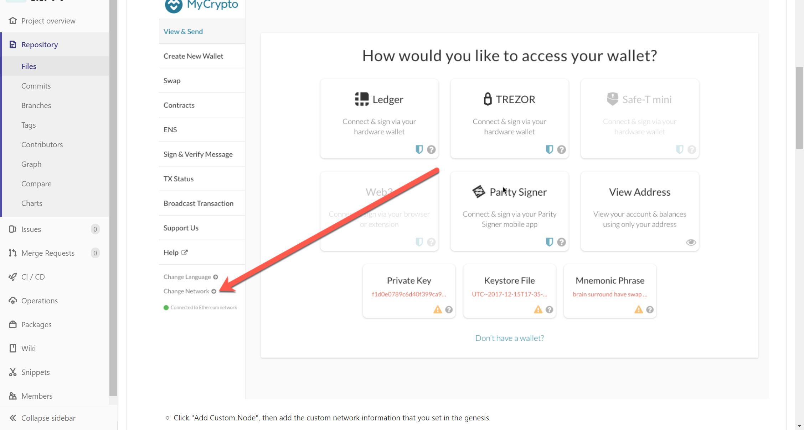
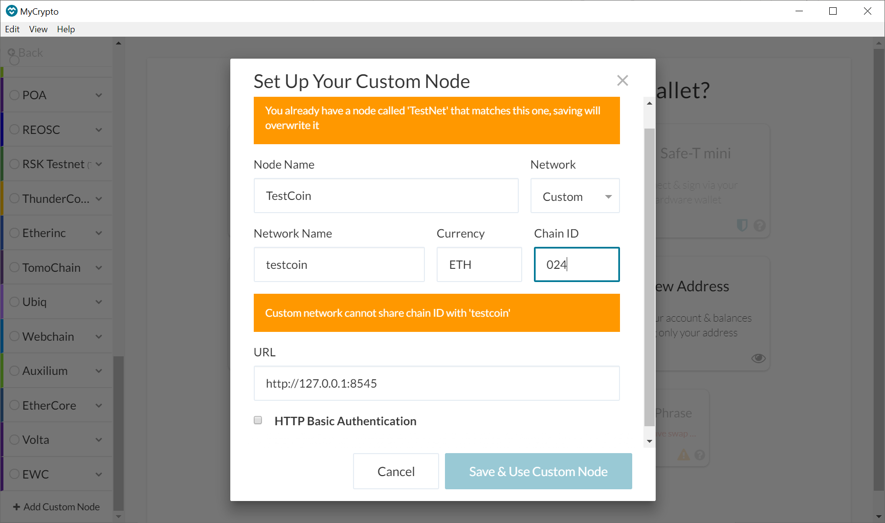
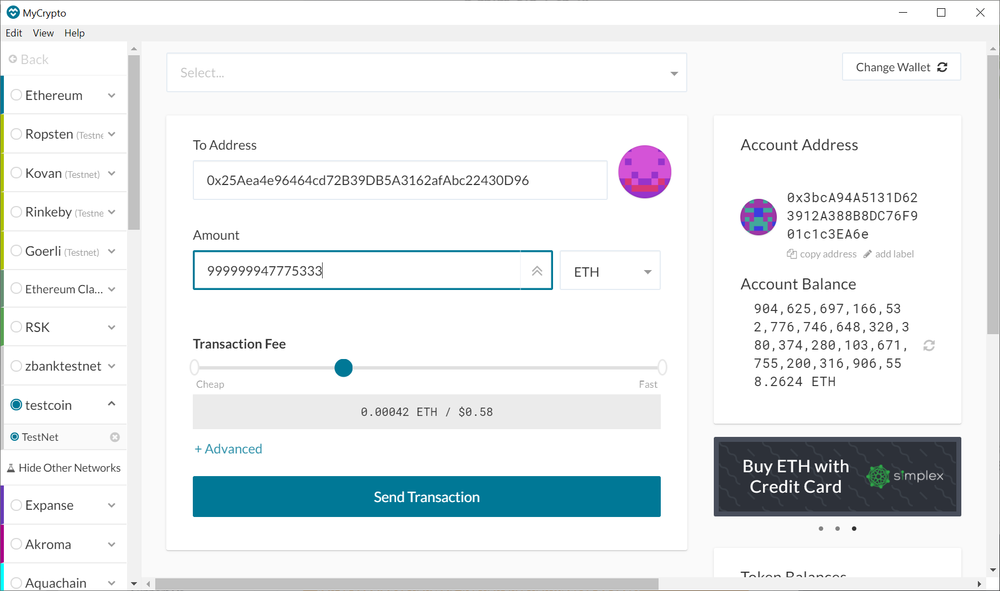
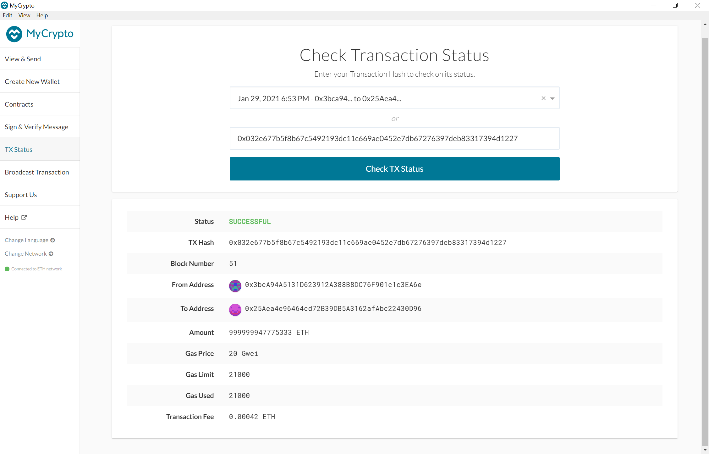
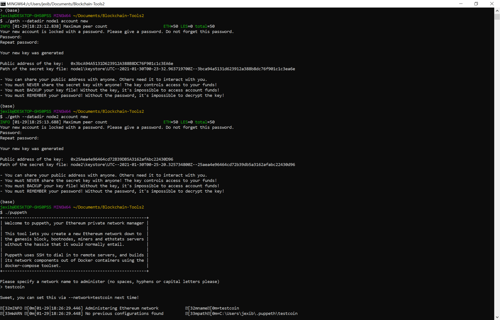
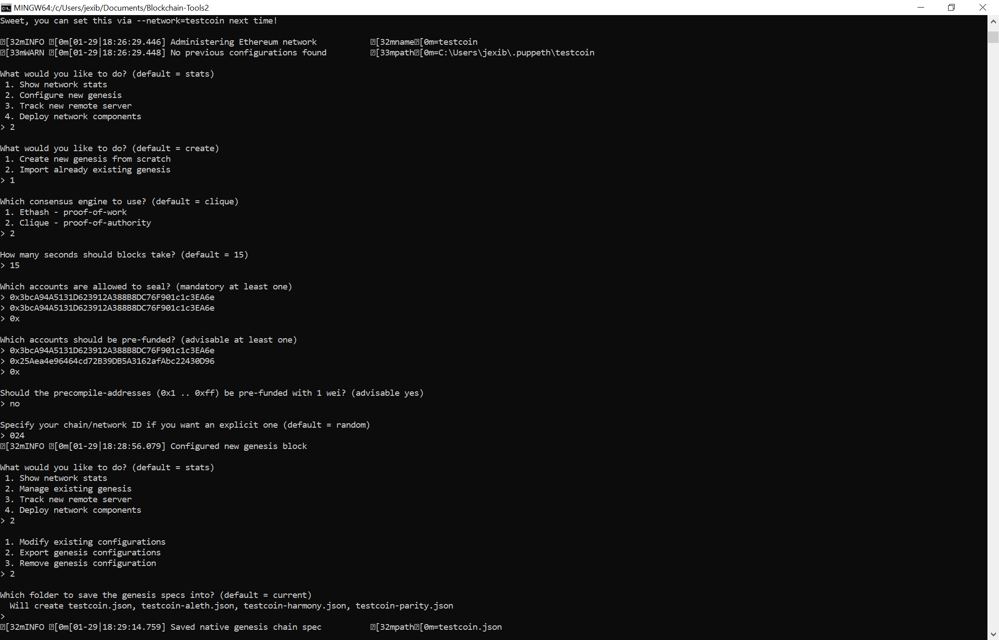

# TestCoin
TestCoin is a testnet blockchain created for ZBank which is exploring blockchain's technology.

## TestCoin instructions
* To run Testcoin you must have downloaded MyCrypto which is a blockchain wallet and will be used to make test transactions. Also you need to install Go  Ethereum "Geth & Tools 1.9.7" in which was created TestCoin blockchain and which is needed to run the nodes.
* Copy in your Geth & Tools the testcoin.json file and the node1 and node2 folders.
* The password foe node1 and node2 is 412.
* Open your terminal and navigate to your Geth & Tools folder.
* Run the code to start mining ./geth --datadir node1 --unlock "3bcA94A5131D623912A388B8DC76F901c1c3EA6e" --mine --minerthreads 1. This code had the public address of node1, the --mine gave the instrucction to star mining. When you run this code it will ask for a password which is 412 to start mining. 
* Open a second terminal and navigate to your Geth & Tools folder.
* Copy this code ./geth --datadir node2 --unlock "25Aea4e96464cd72B39DB5A3162afAbc22430D96" --port 30304 --rpc --bootnodes "enode://eff5bb7e70e72af9dc095ee465b96f734091a968f81736c34024b32728a17555ea4d41b8c8124ddf4c9a884b97435934b1bbed69c54191f8b218f0cc22fbc0fb@127.0.0.1:30303" --ipcdisable --allow-insecure-unlock
* That code had the public address of the second node, and the enode which is given after you start running the first node. Importat to check if the enode changes after you star running node1. In case it changes you must copy the new enode in the code. It also had the port number which connect to MyCrypto.
* Start running node2.
* Open MyCrypto, go to Change Network, and go all the way down to Add Custom Node.
* 
* Then, set up the custom node. In Network select Custom, then add the node name, the network name is testcoin, Currency ETH, Chain ID 024, and the URL http://127.0.0.1:8545.
* 
* After connecting to the new network go to Keystore File to import node1 keystore which is inside of Geth & Tools folder, node1, keystore. Then add the password 412.
* Finally you can make test transactions from node1 to node2 (public address).
* 
* Check the status of your transaction in  TX Status.
* 
  
  ## Nodes Information 
  * Node1: Public address of the key:   0x3bcA94A5131D623912A388B8DC76F901c1c3EA6e
  * Node2: Public address of the key:   0x25Aea4e96464cd72B39DB5A3162afAbc22430D96
  
  ### How the genesis block was created
  
  

  
  
  